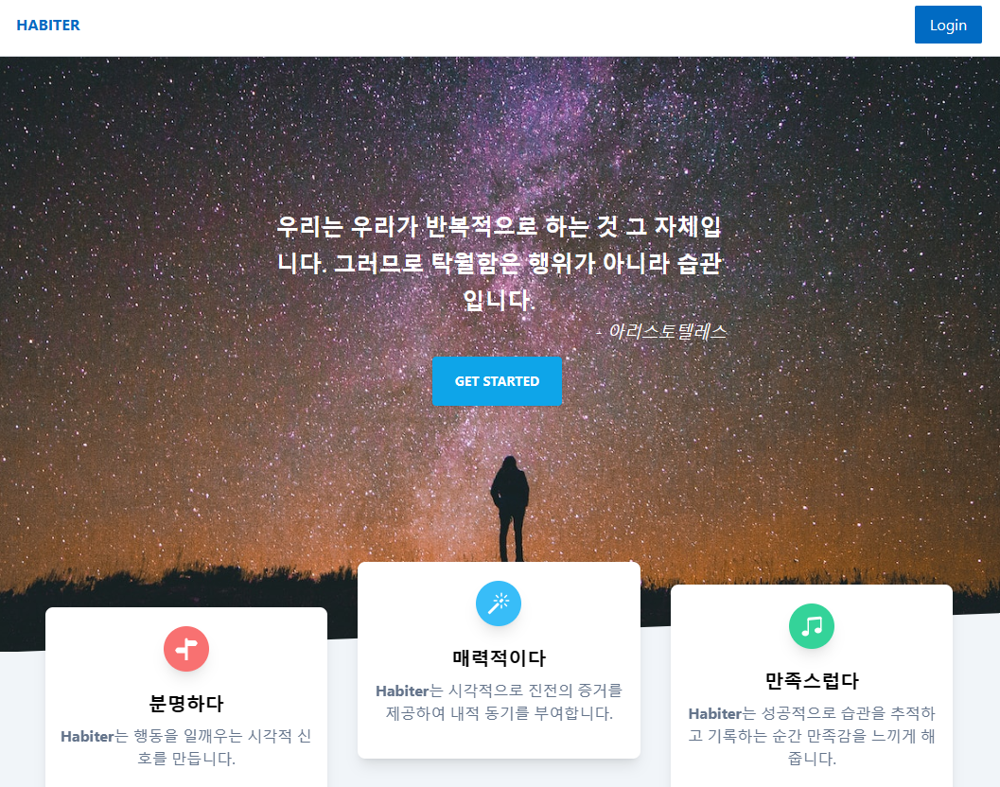
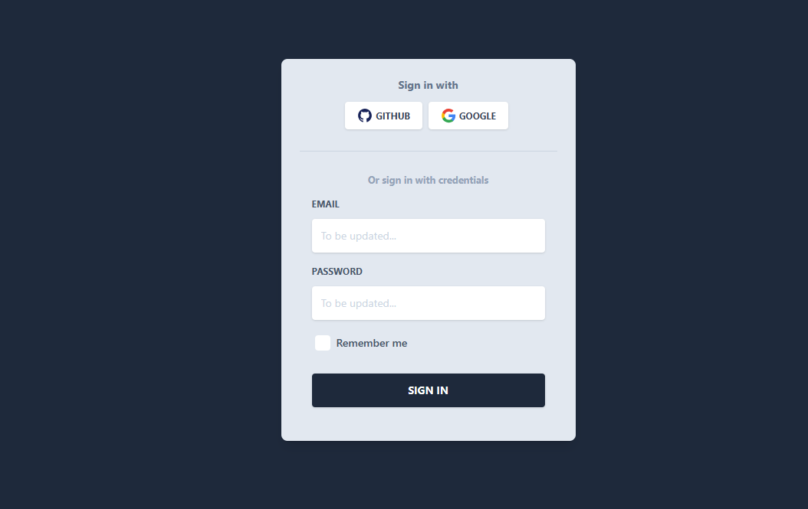
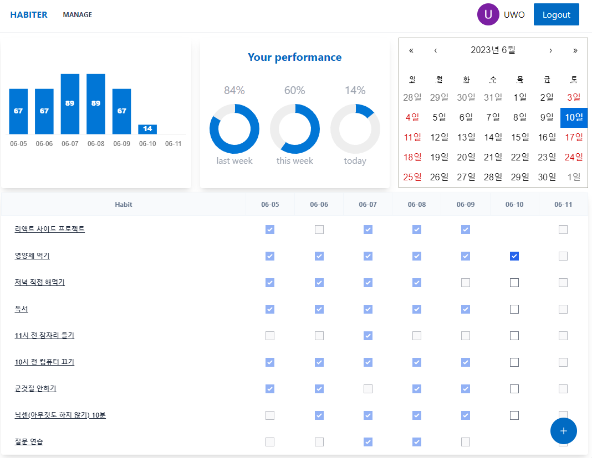
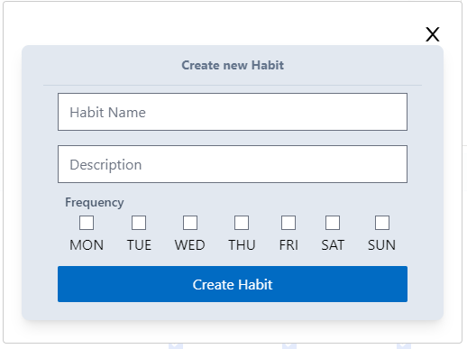
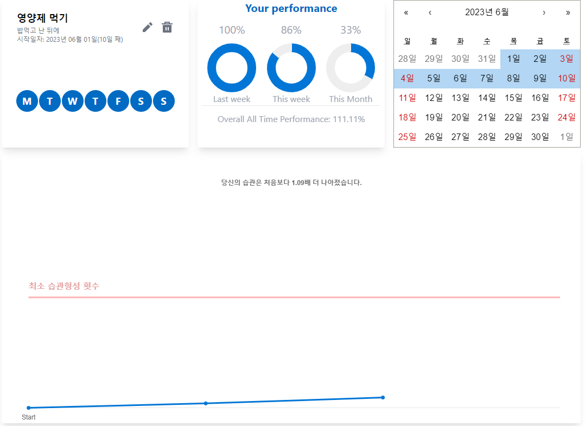

# Habit Tracker

## Table of Contents

- [About](#about)
- [Features and Stack](#features-and-stack)
- [Screenshots](#screenshots)

## About

Habit tracker는 장기적 발전을 위해 시스템을 만들어 계속해서 개선하고 발전해나가는 순환고리를 만들기 위한 습관 추적 시스템입니다.

## Features and Stack

### Features

- GitHub 또는 Google을 사용하여 인증
- 습관 추가, 수정 및 삭제
- 습관 완료 및 건너뛰기로 표시
- 주간 실적은 막대차트로 시각화합니다.
- 지난 주, 현재 주, 현재 날짜 및 모든 시간에 대한 성능에 대한 간략한 요약

### Stack

- React v18
- React Query
- React Router v6
- Firebase
  - Authentication
  - Realtime Database

### Screenshots

- 랜딩페이지!
  
- Github, Google을 활용한 로그인
  
- 대시보드에서 습관을 추적 및 기록할 수 있습니다.
  
- 습관 이름, 내용 및 빈도를 등록, 수정할 수 있습니다.
  
- 상세페이지에서는 습관을 수정, 삭제할 수 있고, 습관의 진척도를 확인할 수 있습니다.
  
